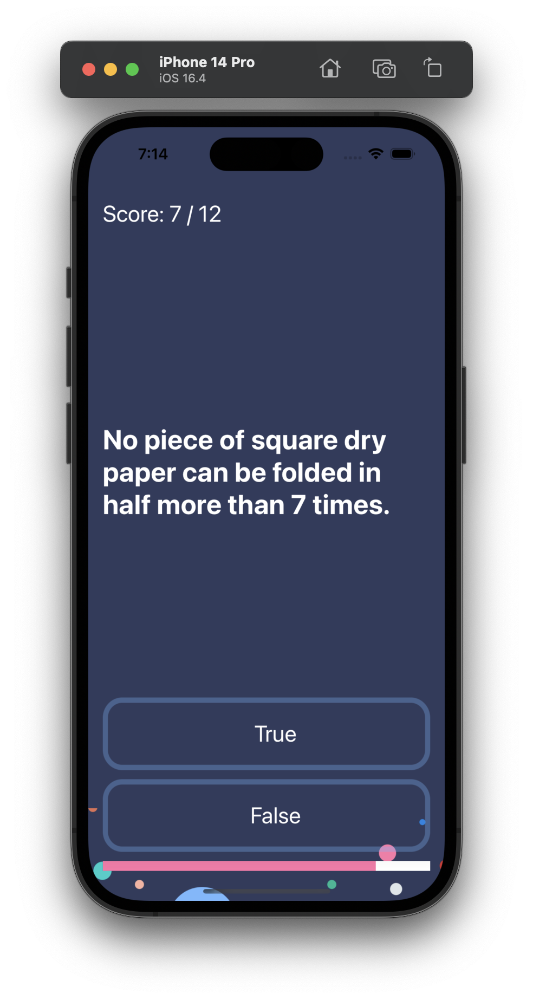

# Quizzler

A quiz application called Quizzler is a program that allows users to participate in interactive quizzes by selecting the correct answer whether it is true or false. This application also includes a scoring system that keeps track of the user's performance. Whenever a user selects the correct answer, their score is incremented accordingly. This feature motivates users to answer questions correctly and strive for a higher score.

## What I learnt

- How to programmatically change UI elements such as Labels and Buttons.
- What is a design pattern and how is it used in programming.
- How to use the Model-View-Controller or MVC pattern for app development.
- Explore Swift Structures and understand the process of instantiating a struct instance.
- Understand the difference between value types and reference types.
- Gain knowledge about Swift Classes and the creation of Objects.
- Compare Swift Classes with Swift Structs and know when to use which.
- Learn the principles of Object-Oriented Programming.
- How to refactor code and stay organised.
